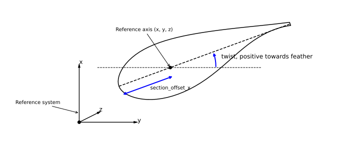
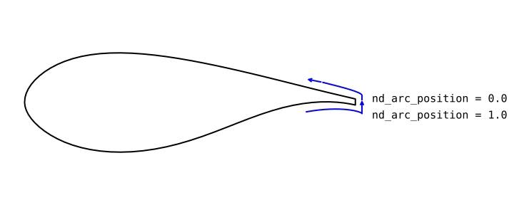
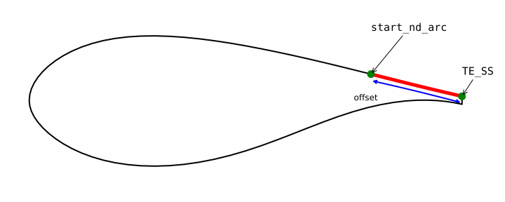
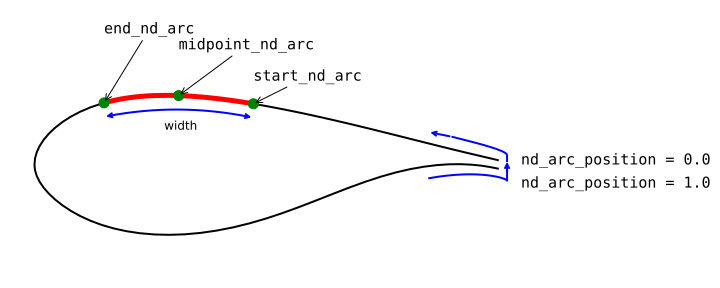
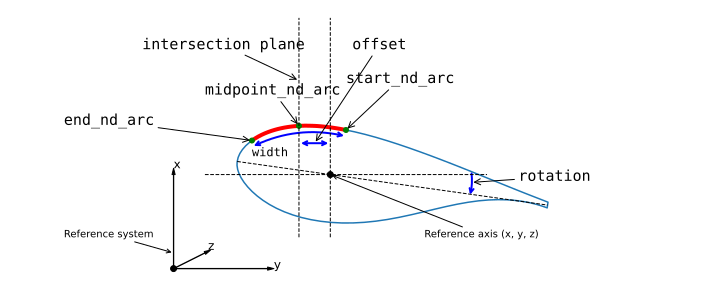
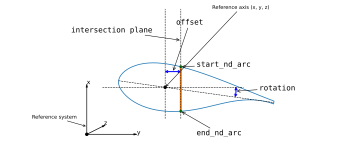

How to Build a Turbine Model
----------------------------

To build a turbine model, you need to create a YAML file that describes the turbine geometry and its components.
The YAML file should follow the schema defined in the `turbine_schema.yaml` file, which is located in the `windIO/schemas/turbine` directory.
The schema is written in YAML format and is used to validate the turbine model.
The schema is also used to generate the documentation for the turbine model.

It is usually best to start from an existing turbine model and modify it to fit your needs.

Here we will walk through the YAML file of the IEA-15MW turbine, which is located in the `windIO/examples/turbine/IEA-15-240-RWT-15MW.yaml` file.

The YAML file is divided into several sections, each describing a different part of the turbine model.
The top level sections are as follows:
- `windIO_version`: Version of windIO used.
- `assembly`: The field assembly includes nine entries that aim at describing the overall configuration of the wind turbine and its components.
- `components`: Specifications for individual components like blades, tower, and nacelle.
- `airfoils`: Database of airfoil coordinates, polars, and unsteady aero parameters.
- `materials`: Database of materials used in the turbine model.
- `control`: Control system.
- `environment`: Environmental conditions and parameters.
- `bos`: Balance of system inputs.
- `costs`: CapEx and OpEx cost inputs.

Note that many text editors allow you to "fold" sections of the YAML file for easier navigation.
Folding collapses sections of the file, making it easier to focus on specific parts of the turbine model.
For example, you can fold the `components` section to hide its details while working on the `assembly` section.
Consult your text editor's documentation to learn how to use this feature.
Here is an example of the `assembly` section from the IEA-15MW turbine YAML file:

.. literalinclude:: ../../windIO/examples/turbine/IEA-15-240-RWT.yaml
    :language: yaml
    :lines: 3-12

Next, let's look at the `components` section, which describes the individual components of the turbine.

Components
----------

Blade
~~~~~

The `blade` section of the turbine YAML file provides detailed specifications for the wind turbine blade. It is divided into the following subfields:

- `reference_axis`: Defines the reference axis of the blade in the blade root coordinate system. This axis is used as the basis for defining both the blade geometry and structural properties.
- `outer_shape`: Describes the external geometry of the blade, including airfoil profiles and their distribution along the blade span. It also includes the blending of airfoil polars.
- `structure`: Specifies the internal structure of the blade, including shear webs and composite material layers.
- `elastic_properties`: Defines the stiffness and inertia properties of the blade, which are critical for structural dynamic analysis.

reference_axis
++++++++++++++

An image representing the `reference_axis` of the blade is shown below.

This is how it looks for the IEA-15:

.. literalinclude:: ../../windIO/examples/turbine/IEA-15-240-RWT.yaml
    :language: yaml
    :lines: 15-24

outer_shape
+++++++++++

Next, the `outer_shape` is defined. Here, follow the  :doc:`detailed_turbine_documentation` for the details. 
It is important to note that each quantity that is distributed along the span is defined in terms of pairs of `grid` and `values`.
The field `grid` maps the distribution of the quantity along the curved length of the reference axis,
while `values` defines the value of the quantity at each grid point.
The grid is defined in terms of a list of values, which are normalized to the 3D curvilinear blade length.

.. literalinclude:: ../../windIO/examples/turbine/IEA-15-240-RWT.yaml
    :language: yaml
    :lines: 25-88

The outer surface used to generate computational meshes for the internal blade structure or high-fidelity aerodynamic modelling 
is defined in `components.blade.outer_shape.surface`. 
This object is defined discretely as a block-structured surface grid with the following structure:

.. code-block:: yaml

    outer_shape:
        surface:
            grid: [0.0, 0.1, ...., 1.0]
            x: 
                - [...]  # x-coordinates for section 1
                - [...]  # x-coordinates for section nsec
            y:
                - [...]
                - [...]
            z:
                - [...]
                - [...]

which will map to a (n_pts, nsec) 2D array where `n_pts` is the number of nodes in the cross-sections along the blade.
We define a local curvilinear mapping that in the spanwise direction follows the :code:`grid` used for the
:code:`reference_axis`.
In the direction along the local cross-section surface arc the field :code:`nd_arc_position` is defined as 0.0 at the trailing edge midpoint,
travelling along the suction side, to the leading edge and pressure side, and is 1.0 at the trailing edge midpoint, see below sketch.

To compute the curve fraction, it is recommended to use an analytical spline evaluation of the curve as basis rather than the discrete points.

structure
+++++++++

The field :code:`components.blade.structure` contains the data to describe the internal composite structure of wind turbine blades.
Defining the structural geometry of a blade is a sophisticated process and the windIO ontology supports different parameterization types
that primarily targets conceptual design.
On the top level, the field :code:`blade.structure` has the sub-sections:

* :code:`anchors`: Defines anchor lines, planes and curves used to place the layup within the outer mold line (OML),
* :code:`webs`: (Optional) Defines the placement and geometry of the shear webs, 
* :code:`layers`: Defines all internal layers in terms of :code:`name`, :code:`material`, :code:`thickness`, number of plies :code:`n_plies`, :code:`fiber_orientation` (for composites), and position. 
* :code:`joints`: (Optional) Defines spanwise segmentation of blades.
* :code:`elastic_properties``: Defines the elastic properties of a beam-representation of the blade.

Anchors are used to define references for placement of layers, shear webs and other main features of the blade structure.

Below list summarises the characteristics and rules for anchors:

* Anchors replace the previous positioning of layers using :code:`start_nd_arc` and :code:`end_nd_arc` in a layer field,
  and add the possibility of defining additional convenient planes and arc positions for placing layers.
* Anchors do not need to coincide with layer edges, but can define layer centers or other convenient positions,
* Anchors *must* define their non-dimensional arc position(s) along the cross-section surface using the `start_nd_arc` and optionally `end_nd_arc` fields,
* While arc positions can be anchored to other anchors, it must be possible to explicitly read the defined anchor arc positions from the windIO file,
  without geometric computatations.
* Convenient schemas are available to define arc positions resulting from plane and ruled surface intersections.
* Anchors do not need to be defined along the entire spanwise grid of the blade.
* Anchors can cross and coincide, but this may pose challenges in mesh generation.
* The previously defined `offset_y_pa` has been deprecated, and hasa been replaced with `plane_intersection`.

The below list defines anchor names that are pre-defined but can be overwitten explicitly by the user:

:code:`name: TE`
    Trailing edge of the blade cross-sections, defined as the midpoint
    between the first and last point of the local cross-section, following the above sketch TE defines two values 
    `start_nd_arc`=0.0 and `end_nd_arc`=1.0.
:code:`name: TE_SS`
    Suction side trailing edge of the blade cross-sections, defined by the
    first point of the local cross-section.
:code:`name: TE_PS`
    Pressure side trailing edge of the blade cross-sections, defined by the
    last point of the local cross-section.

In windIO v1.0, the leading-edge `LE` was pre-defined, however, in windIO 2.0,
the user has to explicitly define this field as an anchor to avoid any ambiguities.

Anchors are defined as a list and the :code:`name` and :code:`start_nd_arc` fields are required.
Depending on the anchor type :code:`end_nd_arc` can also be defined for the anchor.
Below we construct a user-defined leading edge mold split,
that only defines a single arc position along the span, :code:`start_nd_arc`:

.. code-block:: yaml

        -   name: le_mold_split
            start_nd_arc:
                grid: [0.0, 1.0]
                values: [0.47, 0.49]

An anchor can itself be positioned relative to another anchor using the :code:`offset_arc` field referencing the string name of
the anchor, combined with gird/value pair for the dimensioned offset. The offset can also be non-dimensional,
for which the :code:`offset_nd_arc` field is used.

.. code-block:: yaml

        -   name: te_reinforcement_ss
            start_nd_arc:
                grid: [0.0, 1.0]
                values: [0.13, 0.13]
            offset_arc:
                defines: start_nd_arc
                anchor:
                    name: TE_SS
                    handle: start_nd_arc
                grid: [0.0, 1.0]
                values: [0.5, 0.5]

The offset can be both positive or negative.

Arc positions can be defined using the combined :code:`midpoint_nd_arc` and :code:`width` fields:

.. code-block:: yaml

        -   name: le_reinforcement
            start_nd_arc:
                grid: [0.0, 1.0]
                values: [0.47, 0.47]
            end_nd_arc:
                grid: [0.0, 1.0]
                values: [0.53, 0.53]
            midpoint_nd_arc:
                anchor:
                    name: LE
                    handle: start_nd_arc
            width:
                grid: [0.0, 1.0]
                values: [0.4, 0.4]

Anchors can also be defined from plane intersections, which is convenient for defining spar caps
that are typically straight or tapered, or shear webs that similarly intersect the surface with straight intersections.
Below we define the suction side spar cap, where the plane intersection defines the `midpoint_nd_arc`,
which combined with the `width` field results in `start_nd_arc` and `end_nd_arc` forming a constant width patch along the span
(note that the numbers in the fields are arbitrary).

.. code-block:: yaml

        -   name: spar_cap_ss
            start_nd_arc:
                grid: [0., 1.0]
                values: [0.31, 0.33]
            end_nd_arc:
                grid: [0.0, 1.0]
                values: [0.6, 0.6]
            plane_intersection:
                side: suction
                defines: midpoint_nd_arc
                plane_type1:
                    anchor_curve: reference_axis
                    anchors_nd_grid: [0.0, 1.0]
                    rotation: 0.0
                offset:
                    grid: [0.0, 1.0]
                    values: [0.4, 0.0]
            width:
                grid: [0.0, 1.0]
                values: [1.0, 1.0]

The above definition can also be split into two anchors, one that defines the midpoint of the spar cap, and a second one that uses this curve as an anchor, and defining a width,
computes the two edges of the cap.

.. code-block::yaml

        -   name: spar_cap_ss_center
            start_nd_arc:
                grid: [0., 1.0]
                values: [0.45, 0.45]
            plane_intersection:
                side: suction
                defines: start_nd_arc
                plane_type1:
                    anchor_curve: reference_axis
                    anchors_nd_grid: [0.0, 1.0]
                    rotation: 0.0
                offset:
                    grid: [0.0, 1.0]
                    values: [0.0, 0.0]

        -   name: spar_cap_ss
            start_nd_arc:
                grid: [0., 1.0]
                values: [0.31, 0.33]
            end_nd_arc:
                grid: [0.0, 1.0]
                values: [0.6, 0.6]
            midpoint_nd_arc:
                anchor:
                    name: spar_cap_center
                    handle: start_nd_arc
            width:
                grid: [0.0, 1.0]
                values: [1.0, 1.0]

Below we show how to define anchors for a shear web:

.. code-block:: yaml

        -   name: aft_web
            start_nd_arc:
                grid: [0., 1.0]
                values: [0.31, 0.33]
            end_nd_arc:
                grid: [0.0, 1.0]
                values: [0.6, 0.6]
            plane_intersection:
                side: both
                defines: start_end_nd_arc
                intersection_type1:
                    anchor_curve: reference_axis
                    anchors_nd_grid: [0.0, 1.0]
                    rotation: 8.0
                offset:
                    grid: [0.05, 0.95]
                    values: [0.4, 0.0]

The `intersection_type1` intersection is performed as follows:

* Starting from the blade root coordinate system, rotate the lofted blade by the amount defined in :code:`rotation` around the blade `z`-axis using a right-handed rule.
* Interpolate the `x`, `y`, `z` coordinates of the :code:`anchor_curve` curve at the `anchors_nd_grid` non-dimensional arc positions,
  resulting in two points in space.
* Construct a plane spanning the two points, and with a normal vector in the y-z plane perpendicular to the line connecting the two points.
* Offset the plane along the plane normal vector by the amount defined in `offset`. If the offset is not linear, the plane effectively becomes a ruled surface.
* Intersect the plane with the blade surface and compute the `position_nd_arc` of the intersection curve along the span.

The `side` indicates whether to intersect either the suction or pressure side, or both.
`defines` takes the value `start_end_nd_arc` if the resulting intersection results directly in the `start_nd_arc` and `end_nd_arc`,
or takes the value `midpoint_nd_arc` if it is used in combination with the `width` field and so forth.

An alternative and also convenient method to define features in the blade is to intersect the blade with a ruled surface.
In the present implementation the ruled surface is constructed from an offset normal to the anchor curve in the y-z plane.

An example of this type of intersection is given below to compute the location of a
trailing edge shear web with a constant offset from the (curved) trailing edge.
The intersection type is referred to as `intersection_type2`:

.. code-block:: yaml

        -   name: te_web
            start_nd_arc:
                grid: [0., 1.0]
                values: [0.05, 0.1]
            end_nd_arc:
                grid: [0., 1.0]
                values: [0.95, 0.9]
            plane_intersection:
                side: both
                defines: start_end_nd_arc
                intersection_type2:
                    anchor_curve: TE
                    rotation: 0.0
                offset:
                    grid: [0.0, 1.0]
                    values: [0.6, 0.6]

This intersection is performed as follows:

* Starting from the blade root coordinate system, rotate the lofted blade by the amount defined in :code:`rotation` around the blade root `z`-axis using a right-handed rule.
* In the y-z plane construct an offset curve normal to the anchor curve.
* Construct the ruled surface by extrapolating the offset curve along the `x`-axis.
* Intersect the ruled surface with the blade surface and compute the `position_nd_arc` of the intersection curve.

If the resulting intersection is not defined along the entire span of the blade, the last valid intersection point found should be used.
That would in the case of an intersection surface extending beyond the trailing edge, result in the curve coinciding with
the maximum `y`-coordinate of the blade cross-sections, or conversely if it extends beyond the leading edge, the minimum `y`-coordinates of the sections.

The `structure` field often grows quite extensively. For the IEA-15MW turbine, it is defined as follows:

.. literalinclude:: ../../windIO/examples/turbine/IEA-15-240-RWT.yaml
    :language: yaml
    :lines: 89-382

**Web flanges**

To define web flanges the following section can be added to a web definition:

.. code-block:: yaml

    webs:
      - name: fore_web
        ...
        flanges:
          - type: L
            side: suction
            bondline:
                material: glue
                thickness:
                    grid: [0., 0.5, 1.0]
                    values: [0.03, 0.02, 0.01]
            start_nd_arc:
                anchor:
                    name: fore_web_anchor_ss
                    handle: start_nd_arc
            end_nd_arc:
                anchor:
                    name: fore_web_flange_anchor_ss
                    handle: start_nd_arc
          - type: L
            side: pressure
            bondline:
                material: glue
                thickness:
                    grid: [0., 0.5, 1.0]
                    values: [0.03, 0.02, 0.01]
            start_nd_arc:
                anchor:
                    name: fore_web_flange_anchor_ps
                    handle: start_nd_arc
            end_nd_arc:
                anchor:
                    name: fore_web_anchor_ps
                    handle: start_nd_arc

This feature is currently experimental, and details of the schema could be updated in future releases.

**Tapered thickness along the airfoil arc direction**

While it is often a good approximation that thickness of a composite layer is constant along the airfoil arc direction,
this is not the case for core material which is often tapered towards e.g. the trailing edge in a wind turbine blade.
windIO supports specifying thickness as a 2D array, where the first line defines the spanwise grid equivalent to the 1D grid normally used,
and following lines define the chordwise grid that represent the normalized arc distance between the layers' `start_nd_arc` and its `end_nd_arc`.

.. code-block:: yaml

    thickness:
        grid:
            - [0, 0.25, 0.75, 1]
            - [0.25, 0.25, 0.25, 0.25]
            - [0.5, 0.5, 0.5, 0.5]
            - [0.75, 0.75, 0.75, 0.75]
            - [1.0, 1.0, 1.0, 1.0]
        values:
            - [0.0, 0.0, 0.0, 0.0]
            - [0.05, 0.05, 0.05, 0.05]
            - [0.05, 0.05, 0.05, 0.05]
            - [0.05, 0.05, 0.05, 0.05]
            - [0.0, 0.0, 0.0,0.0]

To taper core material linearly, the easiest approach would be to split the core into two separate patches, one with constant thickness,
and another with tapered thickness.

.. code-block:: yaml

    layers:
      - name: TE_SS_filler_taper
        material: foam
        start_nd_arc:
            anchor:
                name: te_reinforcement_ss
                handles: end_nd_arc
        end_nd_arc:
            anchor:
                name: TE_SS_filler_taper
                handles: start_nd_arc
        thickness:
            grid:
                - [0, 0.25, 0.75, 1]
                - [1.0, 1.0, 1.0, 1.0]
            values:
                - [0.0, 0.0, 0.0,0.0]
                - [0.05, 0.05, 0.05, 0.05]
      - name: TE_SS_filler
        material: foam
        start_nd_arc:
            anchor:
                name: TE_SS_filler_taper
                handles: start_nd_arc
        end_nd_arc:
            anchor:
                name: spar_cap_ss
                handles: start_nd_arc
        thickness:
            grid:
                - [0, 0.25, 0.75, 1]
            values:
                - [0.05, 0.05, 0.05, 0.05]

This feature is currently experimental, and details of the schema could be updated in future releases.

The fourth and last field of the `blade` component is the `elastic_properties`, whose subfields are:
- `inertia_matrix`: Defines the inertia properties of the blade, including mass and moment of inertia.
- `stiffness_matrix`: Defines the stiffness properties of the blade, including bending and torsional stiffness.
- `structural_damping`: Defines the structural damping properties of the blade, currently in Rayleigh format `mu`.
- `added_mass`: Defines non-structural mass in the blade, such as lightning protection, root bolts etc, which is not
  defined or modelled as part of the composite structure.

The `elastic_properties` field of the IEA-15MW turbine is defined as follows:

.. literalinclude:: ../../windIO/examples/turbine/IEA-15-240-RWT.yaml
    :language: yaml
    :lines: 383-417

Hub
~~~

The `hub` section of the turbine YAML file provides detailed specifications for the wind turbine hub. Only a few fields are required, namely `diameter`, `cone_angle`, and drag coefficient `cd`. Users can also decide to simply define the `elastic_properties`. The hub of the IEA-15MW turbine is defined as shown below. Note that many inputs are optional and currently only used by NREL's systems engineering tool WISDEM, which was used to design the IEA-15MW turbine.

.. literalinclude:: ../../windIO/examples/turbine/IEA-15-240-RWT.yaml
    :language: yaml
    :lines: 418-438

Drivetrain
~~~~~~~~~~
The `drivetrain` section of the turbine YAML file provides detailed specifications for the wind turbine drivetrain. It includes the following subfields:
- `outer_shape`: Defines the outer shape of the nacelle
- `lss`: Defines the low-speed shaft
- `hss`: Defines the high-speed shaft, when present
- `gearbox`: Defines the gearbox, when present
- `generator`: Defines the generator
- `nose`: Defines the nose
- `bedplate`: Defines the bedplate
- `other_components`: Defines the auxiliary components of the nacelle
- `elastic_properties`: Defines the equivalent elastic properties of the nacelle

Users should refer to the :doc:`detailed_turbine_documentation` for the details of each subfield. The drivetrain of the IEA-15MW turbine is defined as shown below. Note that many inputs are optional and currently only used by NREL's systems engineering tool WISDEM, which was used to design the IEA-15MW turbine.

.. literalinclude:: ../../windIO/examples/turbine/IEA-15-240-RWT.yaml
    :language: yaml
    :lines: 439-542

Yaw
~~~
The `yaw` section of the turbine YAML file provides detailed specifications for the wind turbine yaw system. Currently it only includes the equivalent `elastic_properties` of the yaw system. The yaw system of the IEA-15MW turbine is defined as shown below.

.. literalinclude:: ../../windIO/examples/turbine/IEA-15-240-RWT.yaml
    :language: yaml
    :lines: 543-547

Tower
~~~~~
The `tower` section of the turbine YAML file provides detailed specifications for the wind turbine tower. It includes the following subfields:
- `reference_axis`: Defines the reference axis of the tower in the tower base coordinate system. This axis is used as the basis for defining both the tower geometry and structural properties.
- `outer_shape`: Defines the outer shape of the tower
- `structure`: Defines the inner structure of the tower
- `elastic_properties`: Defines the equivalent elastic properties of the tower

.. literalinclude:: ../../windIO/examples/turbine/IEA-15-240-RWT.yaml
    :language: yaml
    :lines: 548-573

Monopile
~~~~~~~~
The `monopile` section of the turbine YAML file provides detailed specifications for the wind turbine monopile, when present. It includes the following subfields:
- `reference_axis`: Defines the reference axis of the monopile in the tower base coordinate system. This axis is used as the basis for defining both the monopile geometry and structural properties.
- `outer_shape`: Defines the outer shape of the monopile
- `structure`: Defines the inner structure of the monopile
- `elastic_properties`: Defines the equivalent elastic properties of the monopile

.. literalinclude:: ../../windIO/examples/turbine/IEA-15-240-RWT.yaml
    :language: yaml
    :lines: 574-602

Floating platform
~~~~~~~~~~~~~~~~~
The `floating_platform` section of the turbine YAML file provides detailed specifications for the wind turbine floating platform, when present. It includes the following subfields:
- `transition_piece_mass`
- `transition_piece_cost`
- `joints`
- `members`

The floating platform of the IEA-15MW turbine is defined as shown below.

.. literalinclude:: ../../windIO/examples/turbine/IEA-15-240-RWT_VolturnUS-S.yaml
    :language: yaml
    :lines: 574-766

Users should refer to the :doc:`detailed_turbine_documentation` for the details of each subfield.

Mooring
~~~~~~~
The `mooring` section of the turbine YAML file provides detailed specifications for the floating wind turbine mooring system, when present. It includes the following subfields:
- `nodes`: Defines the nodes of the mooring system
- `lines`: Defines the lines of the mooring system
- `line_types`: Defines the characteristics of the lines
- `anchor_types`: Defines the characteristics of the anchors

The floating platform of the IEA-15MW turbine is defined as shown below.

.. literalinclude:: ../../windIO/examples/turbine/IEA-15-240-RWT_VolturnUS-S.yaml
    :language: yaml
    :lines: 767-819

Users should refer to the :doc:`detailed_turbine_documentation` for the details of each subfield.

Airfoils
---------------
The `airfoils` section of the turbine YAML file provides a database of airfoil coordinates, polars, and unsteady aero parameters. Each aifoil includes the following subfields:
- `coordinates`: Defines the coordinates of the airfoils
- `aerodynamic_center`: Defines the chordwise position of aerodynamic center of the airfoils
- `rthick`: Defines the relative thickness of the airfoils
- `polars`: Defines the polars of the airfoils

Multiple sets of `polars` can be defined for each airfoil at varying conditions, for example distinguishing wind tunnel conditions and numerical results, or different roughness conditions. Also, for each configuration, multiple sets of polars can be defined at varying Reynolds number. Note that for every set of polars the user can opt to specify the unsteady parameters often required by aeroelastic models.

An example of the `FFA-W3-211` airfoil used in the IEA-15MW turbine is shown below.

.. literalinclude:: ../../windIO/examples/turbine/IEA-15-240-RWT.yaml
    :language: yaml
    :lines: 642-661

Note that in this example only one configuration of polars at a single Re number is defined. The user can define multiple configurations by adding more entries to the `polars` field. The `polars` field is a list of dictionaries, where each dictionary represents a different configuration of polars. Multiple sets of polars for the same configuration under different Re numbers can be defined by adding more entries to the `re_sets` field. The `re_sets` field is a second list of dictionaries, where each dictionary represents polars at varying Reynolds.

Materials
---------

The `materials` section of the turbine YAML file provides detailed specifications for the materials used in the wind turbine. The details of each entry are discussed in the page :doc:`detailed_turbine_documentation`. An example of the material `glass_biax` used in the IEA-15MW turbine is shown below.

.. literalinclude:: ../../windIO/examples/turbine/IEA-15-240-RWT.yaml
    :language: yaml
    :lines: 878-901

Control
-------
The `control` section of the turbine YAML file provides detailed specifications for the wind turbine control system. It includes the following subfields:
- `supervisory`: Defines the parameters of the supervisory control system
- `pitch`: Defines the parameters of the pitch control system
- `torque`: Defines the parameters of the torque control system
- `yaw`: Defines the parameters of the yaw control system

The details of each field are discussed in the page :doc:`detailed_turbine_documentation`. An example of the `control` section of the IEA-15MW turbine is shown below.

.. literalinclude:: ../../windIO/examples/turbine/IEA-15-240-RWT.yaml
    :language: yaml
    :lines: 970-984

Environment
-----------
The `environment` section of the turbine YAML file provides detailed specifications for the environmental conditions and parameters faced by the wind turbine. The details of each field are discussed in the page :doc:`detailed_turbine_documentation`. An example of the `environment` section of the IEA-15MW turbine is shown below.

.. literalinclude:: ../../windIO/examples/turbine/IEA-15-240-RWT.yaml
    :language: yaml
    :lines: 985-997

Balance of System (BoS)
-----------------------
The `bos` section of the turbine YAML file provides detailed specifications for the balance of system inputs. The details of each field are discussed in the page :doc:`detailed_turbine_documentation`. An example of the `bos` section of the IEA-15MW turbine is shown below.

.. literalinclude:: ../../windIO/examples/turbine/IEA-15-240-RWT.yaml
    :language: yaml
    :lines: 998-1014

Costs
-----
The `costs` section of the turbine YAML file provides detailed specifications for the capital and operational expenditures of the wind turbine. The details of each field are discussed in the page :doc:`detailed_turbine_documentation`. An example of the `costs` section of the IEA-15MW turbine is shown below.

.. literalinclude:: ../../windIO/examples/turbine/IEA-15-240-RWT.yaml
    :language: yaml
    :lines: 1015-1042